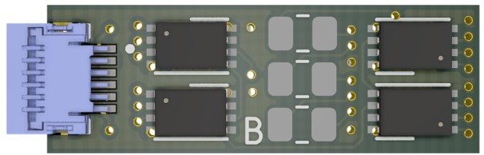
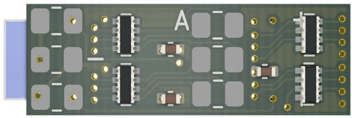

# RTB_E12

This module implements a compact 12-channel WS2811 PCB designed to fit within a signal's socket. Connectivity is provided via an FFC cable to an adapter board (P15) mounted beneath the layout, which allows the signal to be easily detached—for example, during transportation. The E12 can be cascaded with other WS28xx compatible chips.

See also

- [RTB_E10](https://github.com/git4dcc/RTB_E10)
- [RTB_E13](https://github.com/git4dcc/RTB_E13)
- [RTB_E15](https://github.com/git4dcc/RTB_E15)

User Guides

- [User Guide - DE](https://rtb4dcc.de/ws2811_guide_de/)
- User Guide - EN

The module has the following features,
- **Protocol**
  - WS2811 chip protocol
- **LED ports**
  - fixed 12 channel (4x WS2811 chips)
  - +5V common LED voltage (common anode)
  - 255 step PWM

# Hardware
The PCB layout uses SMD footprints with 0.5mm pitch and 0402 parts. Reflow soldering is mandatory.

The hardware does pull operation with 5V common.

## PCB
- 4-layer PCB, FR4, 0.8mm, 18x6mm
- CPU: none (native WS2811 chips)
- BUS: WS2811
- LED: pull /w common anode
 

**Top**

**Bottom**

[Schematic](doc/E12_schematic.pdf) | [Layout](doc/E12_layout.pdf) | [Gerber](gerber)

## Firmware
This module does **not** have any firmware code (uses native WS2811 chips).

# Use Case
The E12 module is housed within the signal's socket and links to the adapter, located beneath the layout, through a flexible flat cable (FFC).

 
